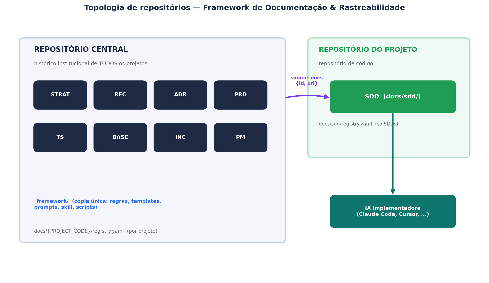
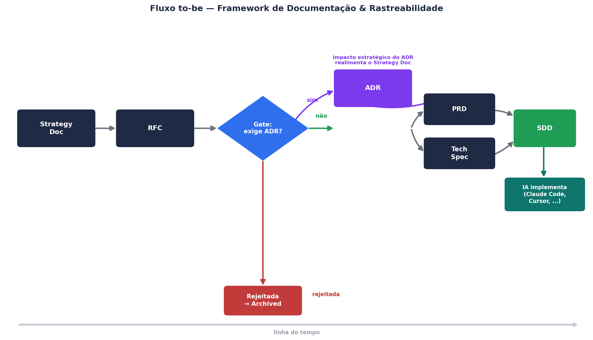

# Framework de Documentação & Rastreabilidade para IA

**Especificação v1.1.0**

Projeto: Framework de uso de IA · 15 de agosto de 2026

## 1. Objetivo e o que mudou desde a v1.0.0

Este documento define a versão 1.1.0 do framework para criar, registrar e rastrear os documentos de decisão de um projeto, reaplicável a projetos diferentes e com skills/prompts que produzem o mesmo resultado em qualquer ferramenta de IA. A v1.0.0 corrigiu o gap original (gate de decisão entre RFC e ADR) e definiu a SDD como input de implementação para IA. A v1.1.0 incorpora três evoluções discutidas e validadas em conjunto:

- Um modelo explícito de dois repositórios (central + por projeto), em vez de assumir um único repositório.
- Um procedimento de onboarding para projetos que já existiam antes deste framework.
- Um fluxo apartado, mas rastreável, para incidentes e postmortem.

Também foram entregues dois guias de uso — um técnico e um sem jargão para pessoas não técnicas — para reduzir a fricção de adoção.

## 2. Modelo de dois repositórios

O framework nunca assume um único repositório. Um repositório central guarda a cópia única de `_framework/` (regras, templates, prompts, skill, scripts) e `docs/{PROJECT_CODE}/` de todos os projetos — mas somente os tipos Strategy Doc, RFC, ADR, PRD, Tech Spec, Baseline, Incidente e Postmortem. Cada projeto tem também seu próprio repositório de código, e é ali — e somente ali — que a SDD nasce e vive, em `docs/sdd/`, porque é o único documento pensado para ser lido por uma IA no momento de implementar.

Como PRD, Tech Spec e ADR vivem no repositório central mas a SDD que os consolida vive no repositório do projeto, toda referência de uma SDD aos seus documentos de origem (`source_docs`) carrega não só o `id`, mas a URL completa do arquivo no repositório central — sem isso a cadeia de rastreabilidade quebraria ao atravessar repositórios.

## 3. Fluxo principal e gate de decisão

Leitura do fluxo: Strategy Doc origina uma ou mais RFCs; após a RFC ser aprovada, o gate decide se um ADR é necessário; PRD e Tech Spec seguem, com ou sem ADR; e a SDD, compilada a partir deles, é o artefato final consumido por ferramentas de IA de implementação, criada no repositório do projeto.

| # | Critério do gate RFC → ADR | Exemplo |
|---|---|---|
| 1 | Introduz ou altera um padrão arquitetural | Novo serviço, mudança de topologia |
| 2 | Decisão de alto custo ou difícil reversão | Rollback caro, lento ou impossível |
| 3 | Trade-off técnico relevante entre alternativas | Mais de uma opção viável, prós/contras a registrar |
| 4 | Impacto cross-team | Mais de um time/domínio diretamente afetado |
| 5 | Troca ou introdução de tecnologia/vendor relevante | Novo banco de dados, provedor cloud, linguagem, lib crítica |

## 4. Onboarding de projeto já existente

Quando um projeto com código já em produção, mas sem nenhum histórico neste framework, precisa ser incorporado, ele passa por um procedimento de duas fases, executado uma única vez.

### 4.1 Fase 1 — Levantamento de baseline

Uma IA lê o repositório de código existente (stack, estrutura, integrações, dívidas técnicas visíveis) e produz um único documento Baseline (BASE), que é um retrato do estado atual — não uma decisão. A partir dele, a IA propõe um ADR para cada decisão de arquitetura que consegue inferir do código, sempre com `provenance=reconstructed` e status inicial `in_review` — nunca `approved` direto, porque é inferência sobre código, não relato de uma decisão presenciada. Uma pessoa do time revisa e confirma ou corrige cada ADR proposto antes de qualquer um ser aprovado. Não se reconstrói PRD ou Tech Spec do que já foi construído: o código já é a especificação do que existe, e o valor de reconstruir está no "porquê" (ADR), não no "como".

### 4.2 Fase 2 — Cutover

Concluída e revisada a Fase 1, o projeto passa a operar exatamente como um projeto novo: a próxima demanda real vira `RFC-{PROJETO}-0001`, segue o gate normalmente, e a primeira SDD nasce no repositório do projeto.

Este procedimento está implementado em `_framework/prompts/onboarding-bootstrap.md`, usado uma única vez por projeto no dia da adoção.

## 5. Incidentes e postmortem

Fluxo apartado do funil principal: não se abre uma RFC para tratar um incidente em andamento. Um Incidente (INC) usa um ciclo de vida operacional próprio — `open → mitigated → resolved → closed` — em vez do ciclo padrão de aprovação, porque não é uma decisão a aprovar, é um evento a acompanhar.

| Severidade | Critério | Postmortem |
|---|---|---|
| SEV1 — Crítico | Indisponibilidade total/crítica, perda de dados, incidente de segurança confirmado | Obrigatório, completo |
| SEV2 — Alto | Degradação relevante de função importante, sem workaround viável | Obrigatório, completo |
| SEV3 — Moderado | Impacto limitado, workaround razoável existe | Obrigatório, leve |
| SEV4 — Baixo | Impacto mínimo/cosmético, sem efeito perceptível ao usuário final | Opcional |

Regra de recorrência: independentemente da severidade individual, se a mesma causa raiz se repetir dentro de uma janela de 90 dias, o postmortem passa a ser obrigatório — um problema de baixo impacto que se repete constantemente é, na prática, um problema estrutural.

O Postmortem (PM) segue o ciclo de vida padrão do framework (é um documento analítico, não operacional) e cada action item é triado: um ajuste pontual sem nenhum critério do gate aplicável vira PRD/Tech Spec direto; uma mudança estrutural (que atenderia a algum critério do gate RFC→ADR) vira uma nova RFC, referenciando o postmortem de origem, e segue o fluxo normal a partir daí — reaproveitando a mesma régua de decisão em vez de criar uma nova.

## 6. Exemplo ponta a ponta (validado)

O kit inclui três cenários de exemplo, todos validados com `registry_tools.py validate` e `trace`:

- `examples/central/EXEMPLO/` — projeto novo, demonstrando os dois caminhos do gate: `RFC-EXEMPLO-0001` (exige ADR) e `RFC-EXEMPLO-0002` (não exige, segue direto para PRD/Tech Spec).
- `examples/project-repo-checkout/docs/sdd/` — repositório de projeto correspondente, com as duas SDDs e `source_docs` apontando via `id`+`url` para o repositório central.
- `examples/central/LEGADO/` — projeto já existente sendo incorporado: `BASE-LEGADO-0001` e um ADR reconstruído aprovado, um incidente SEV2 (`INC-LEGADO-0001`), o postmortem correspondente (`PM-LEGADO-0001`) e o cutover: `RFC-LEGADO-0001` nascendo de um action item estrutural do postmortem.

O rastreio de `RFC-LEGADO-0001` confirma a cadeia completa: `RFC-LEGADO-0001 → PM-LEGADO-0001 → INC-LEGADO-0001` — ou seja, dá para responder "por que esta RFC existe" com uma resposta real, não uma reconstrução de memória.
